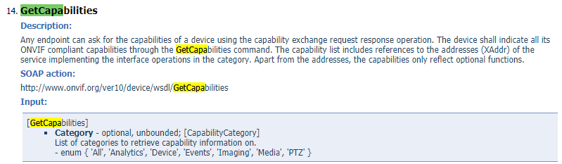
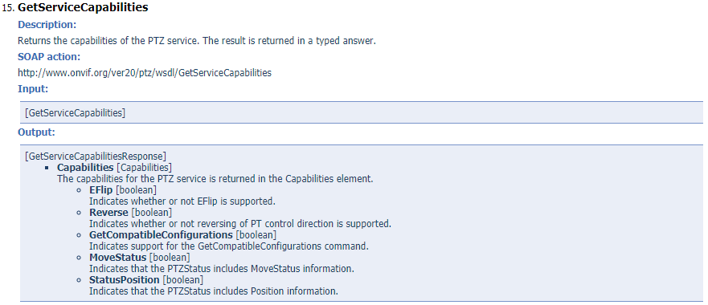
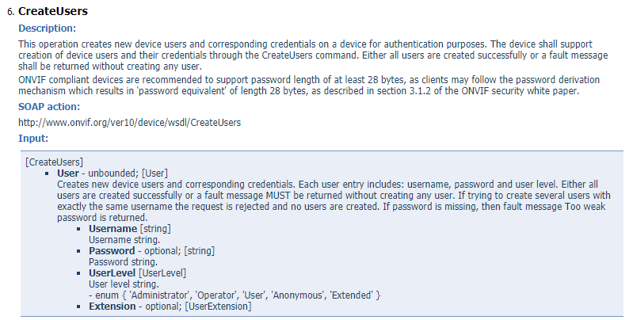

# onvif protocol

Simple management of onvif IP-devices cameras. onvif is an implementation of ONVIF protocol for managing onvif IP devices. The purpose of this library is convenient and easy management of IP cameras and other devices that support ONVIF standard.

## Installation

To install the library, use **go get**:

```go
go get github.com/BalkarSandhu/go-onvif
```

## Running the Application

The application can be run directly using:

```go
go run main.go
```

The server will start with the configuration specified in the `main.go` file.

### Application Configuration

The main application uses a configuration structure that can be customized:

```go
package main

import (
    "log"
    // Choose between XML or JSON APIs
    // "github.com/BalkarSandhu/go-onvif/xml_apis"
    "github.com/BalkarSandhu/go-onvif/json_apis"
)

func main() {
    // Load configuration (could be from environment, flags, or config file)
    config := api.Config{
        Port:          "8081",
        LogLevel:      "info",
        RateLimitReqs: 10, // 10 requests per second
        RateLimitBurst: 20, // Allow bursts of up to 20 requests
    }
    
    // Create and run server
    server := api.NewAPIServer(config)
    server.SetupRoutes()
    if err := server.Run(); err != nil {
        log.Fatalf("Failed to start server: %v", err)
    }
}
```

### API Options

The application supports both XML and JSON APIs:

- For XML-based ONVIF requests, import `"github.com/BalkarSandhu/go-onvif/xml_apis"`
- For JSON-based ONVIF requests, import `"github.com/BalkarSandhu/go-onvif/json_apis"`

You can switch between these APIs by changing the import statement in your application.


# Postman Collection Documentation for go-onvif

This documentation provides examples for testing the go-onvif API using Postman. These examples demonstrate how to interact with ONVIF-compatible IP cameras and devices through the API endpoints.

## Setting Up Postman

To use the provided collection, you'll need to:

1. Import the collection into Postman
2. Configure your environment variables (if using them)
3. Ensure your server is running (see the main README for details)

## Authentication

Most API requests require authentication. The collection uses a pre-request script to automatically add authentication headers to your requests:

```javascript
// Pre-request Script
pm.request.headers.add({
    key: 'username',
    value: 'admin'
});
pm.request.headers.add({
    key: 'password',
    value: 'admin123'
});
pm.request.headers.add({
    key: 'xaddr',
    value: '192.168.1.16'
});
```

You should modify these values to match your camera's credentials and IP address.

## Device Discovery

### Discovery Request

Use this endpoint to discover ONVIF-compatible devices on your network.

**Request:**
- **Method:** GET
- **URL:** `http://localhost:8080/discovery`
- **Headers:**
  - `interface`: "Ethernet 2" (specify your network interface)

**Example Response:**
```json
[{"url":"192.168.29.109","name":"CP"}]
```

This response indicates one ONVIF device was found with the name "CP" at IP address 192.168.29.109.

## Common API Endpoints

Below are examples of common ONVIF operations you can perform:

### Get Device Information

**Request:**
- **Method:** GET
- **URL:** `http://localhost:8080/device/info`
- **Headers:** Authentication headers (username, password, xaddr)

### Get Device Capabilities

**Request:**
- **Method:** GET
- **URL:** `http://localhost:8080/device/capabilities`
- **Headers:** Authentication headers (username, password, xaddr)
- **Query Parameters:**
  - `category`: "All" (can be one of: 'All', 'Analytics', 'Device', 'Events', 'Imaging', 'Media', 'PTZ')

### PTZ Operations

#### Get PTZ Configuration

**Request:**
- **Method:** GET
- **URL:** `http://localhost:8080/ptz/configurations`
- **Headers:** Authentication headers (username, password, xaddr)

#### PTZ Move

**Request:**
- **Method:** POST
- **URL:** `http://localhost:8080/ptz/move`
- **Headers:** Authentication headers (username, password, xaddr)
- **Body:**
```json
{
  "profileToken": "Profile_1",
  "x": 0.5,
  "y": 0.2,
  "zoom": 0.1
}
```

### Media Operations

#### Get Media Profiles

**Request:**
- **Method:** GET
- **URL:** `http://localhost:8080/media/profiles`
- **Headers:** Authentication headers (username, password, xaddr)

#### Get Stream URI

**Request:**
- **Method:** GET
- **URL:** `http://localhost:8080/media/stream`
- **Headers:** Authentication headers (username, password, xaddr)
- **Query Parameters:**
  - `profileToken`: "Profile_1"
  - `protocol`: "RTSP" (or "HTTP", "UDP" depending on camera support)

## Working with the JSON API

If you're using the JSON-based API (as imported in your main.go example):

```go
import "github.com/BalkarSandhu/go-onvif/json_apis"
```

The requests should include JSON in the request bodies and will receive JSON responses.

## Working with the XML API

If you're using the XML-based API:

```go
import "github.com/BalkarSandhu/go-onvif/xml_apis"
```

The requests should include XML in the request bodies and will receive XML responses.

## Example Workflow

A typical workflow might include:

1. Discover devices using the discovery endpoint
2. Get device capabilities to determine supported features
3. Get media profiles
4. Get stream URIs to view camera footage
5. Control camera using PTZ endpoints (if supported)

## Troubleshooting

If you encounter issues with the API:

1. Check that your authentication credentials are correct
2. Verify the camera's IP address is accessible from your server
3. Ensure the camera supports the ONVIF features you're trying to use
4. Check server logs for detailed error information

Remember that different camera models support different ONVIF capabilities, so not all endpoints may work with all cameras.

## Supported services

The following services are implemented:

- Device
- Media
- PTZ
- Imaging
- Event
- Discovery
- Auth(More Options)
- Soap

## Using

### General concept

1) Connecting to the device
2) Authentication (if necessary)
3) Defining Data Types
4) Carrying out the required method

#### Connecting to the device

If there is a device on the network at the address *192.168.13.42*, and its ONVIF services use the *1234* port, then you can connect to the device in the following way:

```go
dev, err := onvif.NewDevice(onvif.DeviceParams{Xaddr: "192.168.13.42:1234"})
```

*The ONVIF port may differ depending on the device, to find out which port to use, you can go to the web interface of the device. **Usually this is 80 port.***

#### Authentication

If any function of the ONVIF services requires authentication, you must use the `Authenticate` method.

```go
device := onvif.NewDevice(onvif.DeviceParams{Xaddr: "192.168.13.42:1234", Username: "username", Password: password})
```

#### Defining Data Types

Each ONVIF service in this library has its own package, in which all data types of this service are defined, and the package name is identical to the service name and begins with a capital letter. onvif defines the structures for each function of each ONVIF service supported by this library. Define the data type of the `GetCapabilities` function of the Device service. This is done as follows:

```go
capabilities := device.GetCapabilities{Category:"All"}
```

Why does the `GetCapabilities` structure have the Category field and why is the value of this field `All`?

The figure below shows the documentation for the [GetCapabilities](https://www.onvif.org/ver10/device/wsdl/devicemgmt.wsdl). It can be seen that the function takes one Category parameter and its value should be one of the following: 'All', 'Analytics',' Device ',' Events', 'Imaging', 'Media' or 'PTZ'`.



An example of defining the data type of `GetServiceCapabilities` function in [PTZ](https://www.onvif.org/ver20/ptz/wsdl/ptz.wsdl):

```go
ptzCapabilities := ptz.GetServiceCapabilities{}
```

The figure below shows that `GetServiceCapabilities` does not accept any arguments.



*Common data types are in the xsd/onvif package. The types of data (structures) that can be shared by all services are defined in the onvif package.*

An example of how to define the data type of the CreateUsers function in [Devicemgmt](https://www.onvif.org/ver10/device/wsdl/devicemgmt.wsdl):

```go
createUsers := device.CreateUsers{User: onvif.User{Username:"admin", Password:"qwerty", UserLevel:"User"}}
```

The figure below shows that, in this example, the `CreateUsers` structure field must be a User whose data type is the User structure containing the Username, Password, UserLevel, and optional Extension fields. The User structure is in the onvif package.



#### Carrying out the required method

To perform any function of one of the ONVIF services whose structure has been defined, you must use the `CallMethod` of the device object.

```go
createUsers := device.CreateUsers{User: onvif.User{Username:"admin", Password:"qwerty", UserLevel:"User"}}
device := onvif.NewDevice(onvif.DeviceParams{Xaddr: "192.168.13.42:1234", Username: "username", Password: password})
device.Authenticate("username", "password")
resp, err := dev.CallMethod(createUsers)
```

## Great Thanks
[onvif](https://github.com/use-go/onvif)